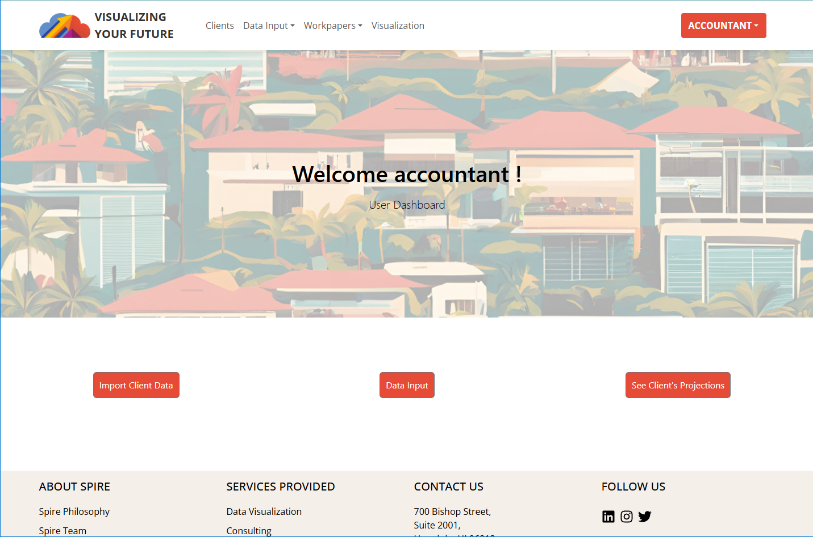

# ICS 414: Software Engineering II
## Course Structure
The course had us  working on a single site project throughout the whole semester which is a layout I like since it allows students to really focus on the work they are producing. We also had the chance to work with real clients, arrange meetings with them, and discuss the products. During these meetings we would present our progress and take note of the clients desire and feedback. We also had weekly reviews where we take a look at two files and give feedback on the code based on given checklists. 
This course centered around a single-site project that spanned the entire semester, which is a structure I appreciated because it allowed us to deeply focus on the work we were producing. We had the opportunity to work with real clients, arrange meetings with them, and discuss the project. During these meetings we presented our progress and noted the clients' desires and feedback. We also had weekly code reviews where we analyzed two files and provided feedback based on specific checklists. This encouraged us to improve our coding practices and refine our work.

## Visualizing Your Future

Our client for this course was Spire, and they tasked us with creating a functional application tailored to their needs. They requested an application that mirrored the functionality of the spreadsheets they had been using. The site we developed included various levels of authorization, with separate roles for accountants and clients. Each client's account contained their budget, workpapers, and projections, which were editable only by authorized accountants.
Visualization of the data was a high priority for the clients, so we incorporated a visualization page that displayed data graphs and comparisons. Unfortunately, due to time constraints, we were unable to implement all the features we envisioned. Future improvements for the site include enhanced visuals for lists, additional workpapers, and an improved user interface for better organization of client information.

## Overall Thoughts
Software Engineering II was much more enjoyable than the first level. While the first level focused on teaching students the foundational programs, languages, and general skills necessary for web development, the second level built upon these tools (Meteor and React) and provided a glimpse into what a career in this field might look like. By grouping us into development teams and allowing us to collaborate with real clients, the course offered a practical, hands-on experience. This opportunity to work with real clients was the most valuable aspect of the class for me, as it bridged the gap between academic learning and professional application. This real-world experience not only enhanced my technical skills but also taught me the importance of effective communication, teamwork, and adaptability when working with clients and meeting their expectations.

