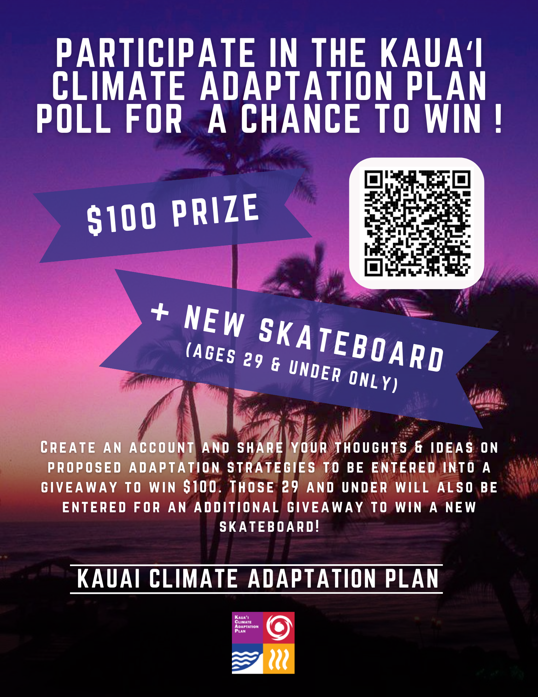
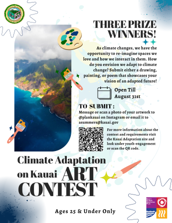

---
layout: project
type: project
image: img/internship_logo.png
title: "Event Flyers"
date: 2023-07-20
published: true
labels:
  - Graphic Design
  - Events
summary: "I was tasked with designing flyers during my internshipt for one of the divisions polls and art event."
--- 

  
  
  

The Planning Division of The County of Kauai created a poll a few months before my internship to gain feedback on some of their possible adaptations to climate change on the island of Kauai. The problem was that they needed more people to take their poll so what they did was they gave me information that they wanted people to know and then asked me to create a flyer for them so I did. The poll flyer is the purple one. The second flyer was to spread the word of an art contest to engage the youth into climate change. The flyer was also used to help advertise the youth submitted that we had begun to plan during my internship.

If you are interested in looking at their site you can go to  : [https://kauaiadaptation.com/](https://kauaiadaptation.com/).

